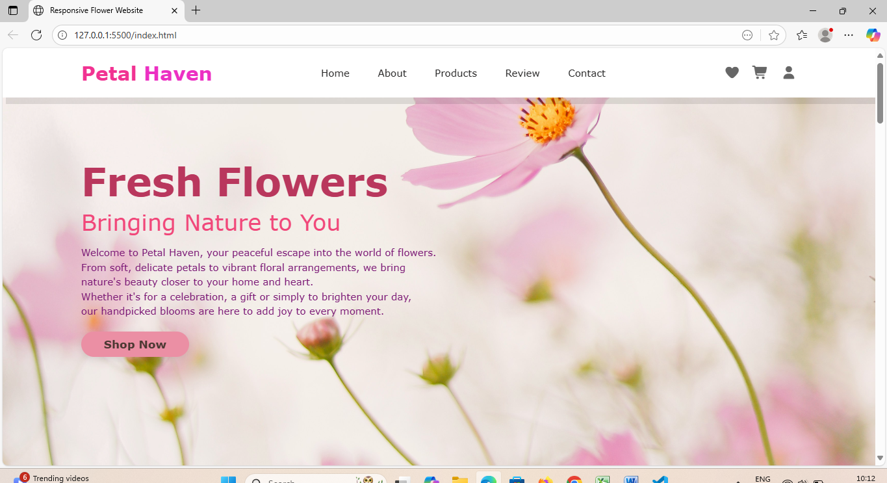
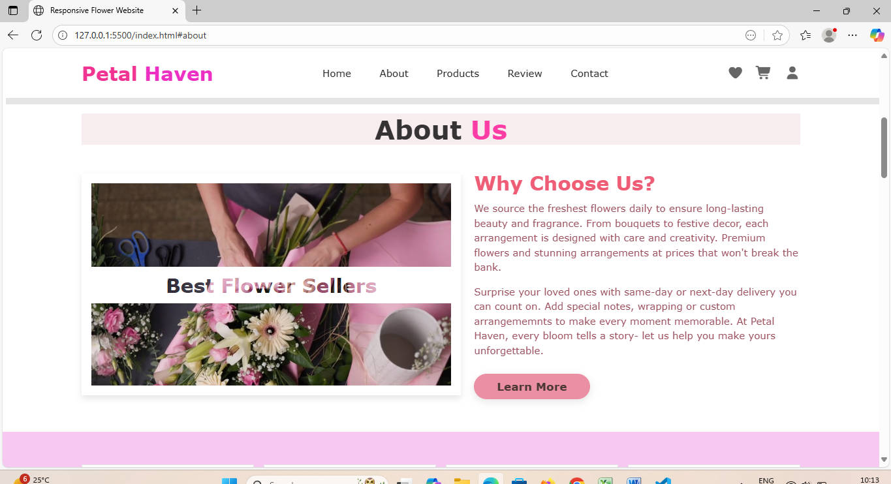
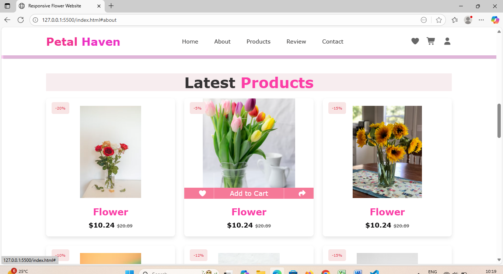

# Petal-Haven
Petal Haven is a simple and elegant flower shop website built entirely with HTML and CSS.
It features responsive design using Media Queries, interactive hover effects and well-structured sections.
The website provides a smooth, user-friendly browsing experience with a soft pastel color palette, making it visually appealing across all devices.

Technologies Used:
-HTML5
-CSS3 (with Media Queries for responsiveness)

## Screenshots:

### Home Page

### About Page

### Products Page

